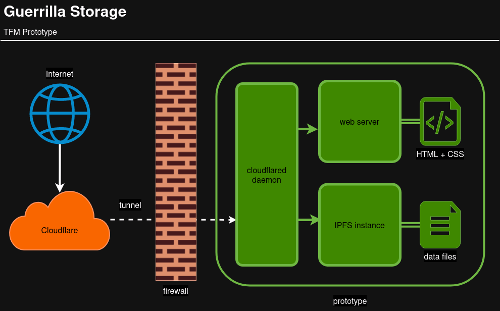

# Prototipo TFM

Este repositorio contiene el prototipo _Guerrilla Storage_, parte del
Trabajo Fin de Máster para la obtención del título Máster en Historia y
Humanidades Digitales de la Universidad Pablo de Olavide.

El siguiente prototipo es una prueba de concepto que auna:

- almacenamiento distribuido basado en [IPFS](https://ipfs.io)
- servicios (gratuitos) de Cloudflare para agilizar y seguridad el acceso
  (túneles y DNS)
- automatización basada en contenedores Docker

La configuración del prototipo es _opinionated_ al tratarse de una prueba
de concepto mínima (_Minimum Viable Prototype_). Al tratarse de un esfuerzo de
integración de componentes es posible modificar distintas partes para permitir
el uso de distintas tecnologías (p.e. usar un servidor web distinto), mecánicas
de acceso (p.e. acceso directo a través de cortafuegos en lugar del uso de
túnel Cloudflare), etc.

## Arquitectura



El prototipo consta de los siguientes elementos:

- instancia [IPFS](https://ipfs.io)
- archivos compartidos a través de IPFS
- servidor web basado en [Caddy](https://caddyserver.com)
- sitio web estático generado a partir de Markdown usando
[Hugo](https://gohugo.io)
- demonio [cloudflared](https://github.com/cloudflare/cloudflared) encargado de
administrar el túnel Cloudflare

El prototipo incluye automáticamente en la instancia de IPFS todos los archivos
localizados en el directorio `./files`. La lista de estos archivos se genera
automáticamente y se incluye en el sitio web estático generado por Hugo. El
túnel Cloudflare permite acceder desde Internet tanto a la instancia IPFS como
al sitio web estático servido a través de Caddy sin necesidad de modificar
ninguna configuración de red (apertura de puertos, configuración de _routers_,
etc).

## Requisitos

El prototipo requiere los siguientes elementos:

- cuenta [Cloudflare](https://www.cloudflare.com/), el plan gratuito es
  suficiente
- nombre de dominio asociado y gestionado por Cloudflare (aproximadamente
  10€/año)
- [túnel Cloudflare](https://www.cloudflare.com/products/tunnel/) creado desde
  la interfaz web de Cloudflare, consulta la documentación sobre cómo [crear
  túnel
  Cloudflare](https://developers.cloudflare.com/cloudflare-one/connections/connect-networks/get-started/create-remote-tunnel/)
- máquina capaz de ejecutar las siguientes herramientas (preferentemente
  sistema operativo GNU/Linux):
  - [Docker](https://www.docker.com/)
  - [Docker Compose](https://docs.docker.com/compose/)
  - `git`
  - `make`
- conexión a Internet

## Obtener código

Clona el repositorio en la máquina que alojará el prototipo

```sh
git clone git@github.com:juanlufont/tfm-prototipo.git
```

En el ejemplo anterior, el directorio raíz del proyecto será `tfm-prototipo`.

## Configuración

El prototipo requiere 2 archivos de configuración:

- `config.mk`
- `token.env`

### Config.mk

Este archivo contiene los detalles sobre los nombres de dominio usados por
el prototipo. Es importante especificar en cada caso si el protocolo web usado
es `http` o `https`.

- `BASEURL`: subdominio usado por el sitio web estático definido por el
  prototipo
- `IPFSURL`: subdominio usado por la instancia IPFS. Es importante especificar
  como protocolo `http` para permitir el acceso a la _http gateway_ de la
  instancia

Ejemplo:

```config
BASEURL = https://upo.ducktective.org
IPFSURL = http://ipfs.ducktective.org
```

En ambos casos, el dominio `ducktective.org` está registrado y asociado a
nuestra cuenta Cloudflare.

### token.env

El archivo `token.env` no se incluye en el repositorio por cuestiones de
seguridad. Este archivo contiene el token que permite acceder al túnel
Cloudflare. **Es importante mantener el contenido de este archivo en secreto**

El prototipo requiere de un archivo `token.env` situado en el directorio raíz
del repositorio y con el siguiente formato:

```bash
TUNNEL_TOKEN=<token_generado_por_el_tunel_cloudflare>
```

## Desplegar

Accede al directorio raíz del repositorio y ejecuta el comando `make`

```bash
cd tfm-prototipo
make
```

El archivo `Makefile` codifica todos los pasos necesarios para el despliegue
del prototipo.

## Acceder al prototipo

Una vez ha finalizado el despliegue del prototipo, es posible acceder al mismo
a través del subdominio definido en la variable `BASEURL`. En el ejemplo
anterior el sitio web estático estará disponible en <https://upo.ducktective.org>

## Parar y limpiar

El archivo `Makefile` incluido en el prototipo incluye los pasos para detener
y eliminar todos los elementos creados durante el proceso de despliegue.

Para parar la ejecución del prototipo y eliminar todos los contenedores Docker
creados en el proceso, ejecuta el siguiente comando en la raíz del repositorio:

```sh
make clean
```

## Observaciones

Algunas observaciones con respecto al prototipo definido en este repositorio:

- este documento recomienda el uso de un dominio y túnel Cloudflare, si bien
  son elementos que simplifican y agilizan el despliegue del prototipo, no son
  imprescindibles y el usuario puede seguir estrategias de despliegue
  alternativas con distintas configuraciones de red
- debido a la naturaleza distribuida de IPFS, el acceso a archivos a través de
  la _gateway_ pública `https://ipfs.io/ipfs` es _best effort_ en el mejor de los
  casos. Algunos archivos compartidos a través de IPFS por este prototipo pueden
  estar disponibles a través de esta gateway pública casi inmediatamente mientras
  que el acceso a otro puede demorarse (casi) indefinidamente. Es posible paliar
  este problema con una configuración más sofisticada de red, pero está fuera del
  alcance de este trabajo
- posibles mejoras y ampliaciones de este prototipo es la inclusión de
  funcionalidad básica de búsqueda en el sitio web estático a través de librerías
  Javascript ejecutadas en el navegador del cliente, la migración a un sitio web
  dinámico incluyendo una base de datos relacional, o la creación de múltiples
  nodos IPFS para incrementar la distribución y redundancia de almacenamiento
